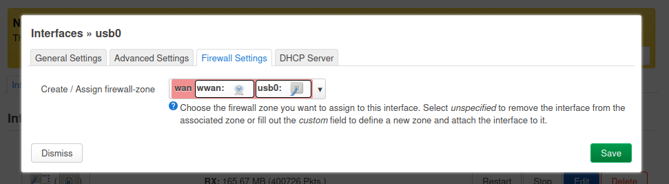

# Background
We may often find ourselves in situations needing to download large files. However, our download link may not always have enough bandwidth, or we could be rate-limited. Wireless@SGx, for example, is widely used but has a limit of 5Mbps (although practically it could reach 30Mbps).

# Idea
Large downloads are often the result of having to download multiple files in aggregate. For example, a model checkpoint download often contains multiple `.safetensor` files. If we have multiple authenticated WANs on a router, we should be able to load balance the individual downloads among these WANs.

# Requirements
In this example, I am utilizing two WANs links. One link will use the onboard Wifi chipset. Another link will use USB tethering from a phone. Modify accordingly if you increase number of WANs / use Ethernet etc.
1. Raspberry Pi ( I use RPi 5 )
2. [OpenWRT Factory Image for Raspberry Pi](https://openwrt.org/toh/raspberry_pi_foundation/raspberry_pi#installation)
3. SD Card
4. Developer Laptop
5. Ethernet Cable

# Setup
1. Follow the [instructions](https://openwrt.org/toh/raspberry_pi_foundation/raspberry_pi#how_to_flash_openwrt_to_an_sd_card) to flash an SD card with the OpenWRT Factory Image.
2. Use Ethernet Cable to connect your Laptop to the Raspberry Pi.
3. Access Router Configuration Page at `192.168.1.1` through a browser.
4. Access the wireless page and authenticate to a Wifi hotspot. Your OpenWRT router should now have access to Internet.
5. Access Router over `ssh root@192.168.1.1`
6. `opkg update && opkg install kmod-usb-net-rndis kmod-usb-net-cdc-ether usbutils `
7. On the Admin page, add a new DHCP client with the usb0 interface. Assign it to LAN firewall zone.

8. ---
title: 'Speeding Up Downloads using Multiple WANs on Raspberry Pi'
date: 2025-12-31
permalink: /posts/2025/12/download-speedup/
tags:
  - Infrastructure
---

# Background
We may often find ourselves in situations needing to download large files. However, our download link may not always have enough bandwidth, or we could be rate-limited. Wireless@SGx, for example, is widely used but has a limit of 5Mbps (although practically it could reach 30Mbps).

# Idea
Large downloads are often the result of having to download multiple files in aggregate. For example, a model checkpoint download often contains multiple `.safetensor` files. If we have multiple authenticated WANs on a router, we should be able to load balance the individual downloads among these WANs.

# Requirements
In this example, I am utilizing two WANs links. One link will use the onboard Wifi chipset. Another link will use USB tethering from a phone. Modify accordingly if you increase number of WANs / use Ethernet etc.
1. Raspberry Pi ( I use RPi 5 )
2. [OpenWRT Factory Image for Raspberry Pi](https://openwrt.org/toh/raspberry_pi_foundation/raspberry_pi#installation)
3. SD Card
4. Developer Laptop
5. Ethernet Cable

# Setup
1. Follow the [instructions](https://openwrt.org/toh/raspberry_pi_foundation/raspberry_pi#how_to_flash_openwrt_to_an_sd_card) to flash an SD card with the OpenWRT Factory Image.
2. Use Ethernet Cable to connect your Laptop to the Raspberry Pi.
3. Access Router Configuration Page at `192.168.1.1` through a browser.
4. Access the wireless page and authenticate to a Wifi hotspot. Your OpenWRT router should now have access to Internet.
5. Access Router over `ssh root@192.168.1.1`
6. `opkg update && opkg install kmod-usb-net-rndis kmod-usb-net-cdc-ether usbutils luci-app-mwan3`
7. On the Admin page, add a new DHCP client with the usb0 interface. Assign it to `wwan` firewall zone.

